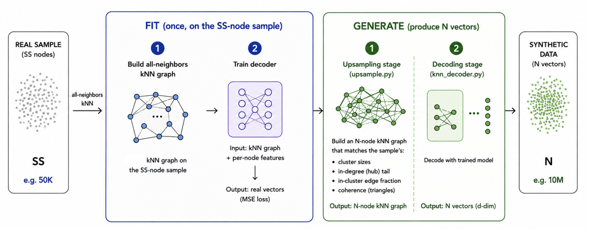
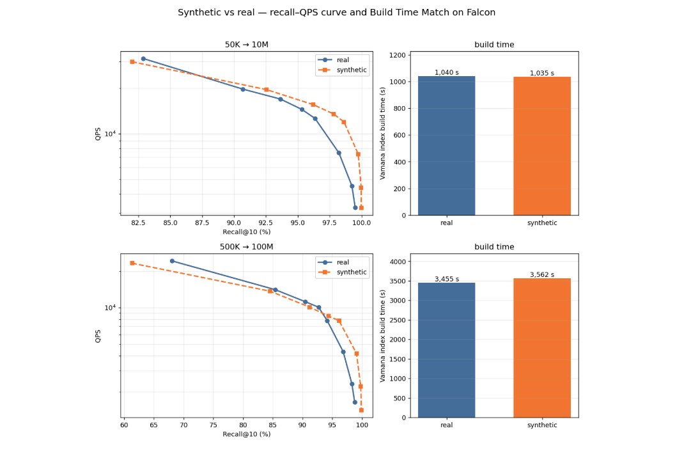

# Billion-Scale Synthetic Data Generator

A synthetic vector-dataset generator for approximate-nearest-neighbor (ANN) benchmarking, built so that an index (Vamana / DiskANN, CAGRA, …) **behaves the same on the synthetic data as on the real data it was fit from** — matching both the **search recall–QPS Pareto** *and* the **index build time**.

## Contents

- **[Background](#background)** — The paper and the shipped baseline this improves on.
- **[1. Core idea](#1-core-idea)** — The fit/generate workflow.
- **[2. How to run](#2-how-to-run)** — Requirements and how to run the pipeline.
- **[3. Headline results](#3-headline-result)** — Some benchmark numbers.
- **[4. Parameters and their effects](#4-parameters-and-their-effects)** — How params affect the result.
- **[5. Block Decode mode](#5-block-decode-mode)** — streaming generate+decode that removes the default path's memory walls.
- **[6. TODOs and future work](#6-todos-and-future-work)** — cheap GT, broader validation, privacy.

---

## Background

This repo assumes you already understand the motivation for our billion-scale synthetic data generator and our existing methodology shipped in `cuvs_bench`.

- **The Paper [(link)](Mimicking_Vector_Datasets_at_Billion_Scale.pdf)** — motivation, and the shipped generator's design and evaluation.
- **`cuvs_bench.synthesize-dataset` [(README)](https://github.com/NVIDIA/cuvs/blob/main/fern/pages/cuvs_bench/synthesize_dataset.md) [(Code)](https://github.com/NVIDIA/cuvs/tree/main/python/cuvs_bench/cuvs_bench/synthesize_dataset)** — the implementation of the generator described in the paper.

**The problem this repo exists to solve:** The shipped generator focused on matching the search recall–QPS Pareto but is unaware of index build time. This repo aims to generate synthetic data that matches **both the recall–QPS Pareto and the build time**.

---

## 1. Core idea

The shipped generator matches vector coordinates. This repo instead matches the **navigability of the kNN graph** — which is what actually drives both build time and search. We model the kNN graph and then decode it back into vectors.

### Workflow



We **fit** on a small `SS`-node real sample and **generate** a large `N`-node synthetic dataset:

**Fit** — once, on the `SS`-node sample:
1. Build the sample's all-neighbors kNN graph and cluster it (KMeans).
2. Measure the graph statistics the upsampled kNN must preserve: cluster sizes, in-degree (hub) tail, in-cluster edge fraction, and the coherence (a.k.a. clustering coefficient — how often my neighbors' neighbors are also my neighbors, i.e. triangle density).
3. Train the decoder (a small neural net of MLPs) to map `(kNN graph + per-node features) → vector`, by regressing each sample node's real embedding from its graph neighborhood.
4. Fit the residual model — a per-cluster low-rank Gaussian (same as the shipped generator in `cuvs_bench`) capturing the within-cluster spread the decoder can't reproduce.

**Generate** — produce `N` vectors in two stages:
1. **Upsampling stage** (`upsample.py`) — build a synthetic `N`-node kNN graph from the fitted statistics.
2. **Decoding stage** (`knn_decoder.py`) — run the trained decoder over that graph to produce `N` vectors (plus residual).

The ANN index then builds and searches over the `N` synthetic vectors; the goal is that its build time and recall–QPS curve match the same index built on `N` *real* vectors.

The two generate stages are the heart of the method, so the rest of this section explains each.

### The Upsampling Stage: Building a coherent `N`-node graph

- *Input:* the fitted statistics of the kNN graph built on the sample data.
- *Output:* an `N`-node kNN graph with the same stats.

The naive approach is to wire the graph straight from the marginal statistics (cluster sizes, in-degree tail, in-cluster edge fraction). That reproduces build time but fails on recall, because drawing edges independently from marginals make a node's neighbors random picks within a cluster. However, in real kNNs, a point's neighbors are close to each other too. Without modeling this local coherence the search recall caps far below real.

So we build coherence straight into the edges. Inside each cluster, lay the nodes in a line and wire each one to a few others in a small sliding window. Because neighboring windows overlap, neighbors end up sharing neighbors, naturally forming triangles. The window width is auto-tuned so the coherence matches the sample's. It's `O(N)` and needs no global kNN pass. Refer to `triadic_coherent_knn` function in `upsample.py`.

On top of the coherent edges, a **[Chung–Lu hub](https://link.springer.com/article/10.1007/pl00012580)** backbone (weights drawn from the sample's measured in-degree distribution) is blended in, tuned by `--knn-frac`, to restore the heavy in-degree tail that plain coherent wiring misses. Refer to `blend_chunglu` function in `upsample.py`.

Coherent edges supply the local structure, and the Chung–Lu blend supplies the hub tail and search difficulty.

### The Decoding Stage: Turn the graph into vectors

- *Input:* an `N`-node synthetic kNN graph (from the upsampling stage).
- *Output:* a `d`-dim vector per node.

We use a **`kNNDecoder`**, which is a small neural net. Decoding runs in three steps:

**1. Turn the kNN graph into per-node features.** The decoder never sees raw coordinates. It only sees the graph. Each synthetic node is assigned an anchor (which is one of the real sample points), and we build its feature vector from two things:
   - the anchor embedding — `MLP(anchor)` of that sample point (roughly, which region of space the node lives in), and
   - structural features read off the graph — the node's in-degree and its neighbors' mean in-degree (how *hub-like* the node and its neighborhood are).

**2. Decode with the model.** For each node in the target `N` nodes, the `kNNDecoder` attention-pools its `k` neighbors' features, concatenates with the node's own features, and passes them through the MLP to output a `d`-dim vector for that node. It was trained (during Fit) with MSE to regress each node's real embedding. But many nodes map to nearly identical inputs (same cluster + similar local graph topology) yet had different real embeddings, so the decoder can only predict the conditional mean for that input (the average of all real vectors whose nodes shared that graph-position). The decoded manifold thus comes out very smooth, dropping the spread among nodes that share the same graph-position.

**3. Add the residual → the spread.** To overcome the smoothness, for each node, draw a sample from a fitted low-rank Gaussian, like we do in the shipped `cuvs_bench` data synthesizer, and add it to the decoded mean. Finally, a radial percentile step resets each vector's norm from its cluster's real norm inverse-CDF (also as we already do in `cuvs_bench`).

---

## 2. How to run

### Requirements
An NVIDIA GPU, plus:
- **RAPIDS cuVS ≥ 26.06** — `cuvs.cluster.kmeans`, `cuvs.neighbors.all_neighbors` / `nn_descent` / `vamana`.
- **PyTorch**, **CuPy**, **NumPy**. (Easiest: a RAPIDS conda env with PyTorch installed into it.)
- (To reproduce results below): DiskANN. Build [microsoft/DiskANN](https://github.com/microsoft/DiskANN).

  ```bash
  git clone https://github.com/microsoft/DiskANN && cd DiskANN
  mkdir build && cd build && cmake .. && make -j
  export DISKANN_APPS=$PWD/apps
  ```

### The pipeline
**Generate data → build the index (build time) → search (recall/QPS)** — run once for synthetic, once for a real reference, then compare.

**1. Real reference.** Omit `--target` to split the sample itself into base + held-out queries + exact GT:
```bash
python generate_data.py --sample SAMPLE.fbin --out-dir out/real_10m
```

**2. Synthetic dataset.** `--target` = number of base vectors; `--n-queries` (default 10000) held-out queries are generated on top (pool = target + n_queries). :
```bash
# 50K sample -> 10M
python generate_data.py --sample SAMPLE_50K.fbin --out-dir out/synth_10m \
    --target 9990000 --nc 500 --resid-rank 32 \
    --resid-scale 1.8 --knn-frac 0.5 --model-cache out/model_cache
```
Each run writes `base.fbin`, `queries.fbin`, `groundtruth.neighbors.ibin`, `groundtruth.distances.fbin`. `--model-cache DIR` caches the trained decoder so repeated runs on the same sample skip the retrain. `python generate_data.py --help` for the rest.

**3. Build the index + measure build time** :
Using the `--save` flag writes `vamana.index` next to the `base.fbin`.
```bash
python build_vamana.py out/synth_10m/base.fbin --num-vectors 9990000 --save
python build_vamana.py out/real_10m/base.fbin --num-vectors 9990000 --save
```

For data too big to build on GPU, call DiskANN's on-disk builder directly over `base.fbin`:
```bash
$DISKANN_APPS/build_disk_index --data_type float --dist_fn l2 \
    --data_path         out/synth_100m/base.fbin \
    --index_path_prefix out/synth_100m/disk_index \
    -R 64 -L 128 -B 8 -M 1000 -QD 192
```

**4. Search / recall–QPS.** The built `vamana.index` loads directly into DiskANN's `search_memory_index`. Pass it as `--index_path_prefix` and sweep the search width `L`, scoring against the bundle's ground truth. Run on both the synthetic and real bundles and compare Recall / QPS across the sweep:
```bash
$DISKANN_APPS/search_memory_index --data_type float --dist_fn l2 \
    --index_path_prefix out/synth_10m/vamana.index \
    --query_file      out/synth_10m/queries.fbin \
    --gt_file         out/synth_10m/groundtruth.bin \
    --recall_at 10 -L 10 20 30 40 50 100 200 300 \
    --result_path     out/synth_10m/res
```

Similar for a large index, but use `search_disk_index` instead.

> DiskANN expects the ground truth as a single truthset file. The bundle writes it as two files (`groundtruth.neighbors.ibin` + `groundtruth.distances.fbin`), so merge them into DiskANN's `[npts, dim]` header + uint32 ids + float32 distances layout first.

### What's in the repo
- **`generate_data.py`** — entry point: fit on a sample, orchestrate the upsampling → decoding stages, write the data.
- **`upsample.py`** — the **upsampling stage**: build the `N`-node graph from the sample graph.
- **`knn_decoder.py`** — the **decoding stage** (`kNNDecoder`): graph → vectors (mean + per-cluster residual + radial norm), plus training.
- **`utils.py`** — shared helpers.
- **`build_vamana.py`** — additional helper that builds a cuVS Vamana index over a `base.fbin`, reports build time. Is irrelevant to the synthetic data generation pipeline.

---

## 3. Headline Result

Both the **recall–QPS search curve** and the **index build time** track real at 200× scale. All experiments are with Falcon:



The raw numbers behind the figure:

**50K → 10M** — build time: real **1,040 s** vs synth **1,035 s**

| Search width `L` | Real 10M — Recall@10 (QPS) | Synthetic 50K→10M — Recall@10 (QPS) |
|:---:|:---:|:---:|
| 10 | 82.88% (31,387) | 82.00% (29,904) |
| 20 | 90.69% (19,719) | 92.55% (19,570) |
| 30 | 93.63% (16,958) | 96.22% (15,564) |
| 40 | 95.31% (14,493) | 97.80% (13,519) |
| 50 | 96.35% (12,617) | 98.62% (11,966) |
| 100 | 98.22% (7,481) | 99.74% (7,326) |
| 200 | 99.24% (4,527) | 99.97% (4,386) |
| 300 | 99.50% (3,255) | 99.98% (3,247) |

**500K → 100M** — build time: real **3,455 s** vs synth **3,562 s**

| Search width `L` | Real 100M — Recall@10 (QPS) | Synthetic 500K→100M — Recall@10 (QPS) |
|:---:|:---:|:---:|
| 10 | 68.04% (24,410) | 61.33% (23,366) |
| 20 | 85.40% (14,100) | 84.53% (13,692) |
| 30 | 90.43% (11,218) | 91.20% (10,098) |
| 40 | 92.70% (10,089) | 94.36% (8,528) |
| 50 | 94.15% (7,795) | 96.14% (7,797) |
| 100 | 96.84% (4,315) | 99.08% (4,167) |
| 200 | 98.30% (2,335) | 99.79% (2,220) |
| 300 | 98.77% (1,647) | 99.89% (1,416) |

To reproduce the datasets use the config below:
```bash
# 50K -> 10M
python generate_data.py --sample SAMPLE_50K.fbin --out-dir out/50k_10m \
    --target 9990000 --nc 500  --resid-rank 32 \
   --resid-scale 1.8 --knn-frac 0.5 --model-cache out/model_cache
python build_vamana.py "$d/base.fbin" --num-vectors 9990000 --save  # Build using cuVS vamana
# Then trasfered to search on DiskANN

# 500K -> 100M
python generate_data.py --sample SAMPLE_500K.fbin --out-dir out/500k_100m \
    --target 99990000 --nc 5000 --resid-rank 32 \
    --resid-scale 1.6 --knn-frac 0.5 --model-cache out/model_cache
# Built and searched using DiskANN
```

---

## 4. Parameters and their effects

This section shares some important knobs and intuition.

### (a) Sample size: the difficulty dial

We recommend using a sample of size `target / 200` or larger. The results in [§3](#3-headline-result) was achieved at this ratio (50K→10M and 500K→100M are both 200×).

### (b) `--knn-frac`: Coherent vs Chung–Lu edge mix
`--knn-frac` sets each node's mix of **coherent** (within-cluster) edges and **Chung–Lu hub** (random) edges.

- **`1.0`** = all coherent: easiest — highest recall, fewest hubs, fastest build.
- **Lower** = more random hub edges: harder search (more distance-comparisons), a heavier hub tail, and higher build time — but recall drops as coherence dilutes.

So `--knn-frac` trades recall against difficulty (and build time). A sweep at 100K→10M:

  | `knn-frac` | build | R@10 @ L=10 (# avg comps) | @ L=50 | @ L=100 |
  |---|---|---|---|---|
  | 0.8 (more coherent) | 878 s | 89.49 (1025) | 99.50 | 99.93 |
  | **0.5** | **1028 s** | **81.57** (1140) | 98.61 | 99.70 |
  | 0.2 (more random) | 1127 s | 63.61 (1251) | 93.75 | 98.42 |
  | *real 10M* | *1040 s* | *82.88* (1010) | *96.35* | *98.22* |

**Takeaway:** `knn_frac` is the coherence↔difficulty balance (moves recall, build, *and* dist-comps together). Push it **up** to make the data easier if recall is too low / build too slow; push it **down** to make the data harder if recall is too high / build too fast.


### (c) `--nc`: Residual/norm cluster count (cuvs-bench's `nc`)

`--nc` sets the number of clusters for the per-cluster residual/norm fit — same as cuvs-bench's `nc`. We recommend setting `--nc ≈ ss/100` (`ss` = sample size), which is also the default if omitted.


### (d) `--resid-scale`: Roughness dial
`--resid-scale` multiplies the per-cluster residual added on top of the decoder's mean vector. It's the **roughness** dial for moving recall.

- **`0`** = decoder mean only: too smooth → recall overshoots real.
- **Higher** = rougher manifold → recall drops and dist-comps rise (most visibly at low `L`), and build time creeps up.

Sweep at 100K→10M (effect concentrated at low `L`):

  | `resid-scale` | build | R@10 @ L=10 (comps) | @ L=50 | @ L=100 |
  |---|---|---|---|---|
  | **1.7** | **1028 s** | **81.57** (1140) | 98.61 | 99.70 |
  | 1.8 | 1057 s | 76.93 (1164) | 98.21 | 99.74 |
  | 2.0 | 1095 s | 72.17 (1210) | 97.26 | 99.56 |
  | *real 10M* | *1040 s* | *82.88* (1010) | *96.35* | *98.22* |


**Takeaway:** Push it **up** if the data is too easy (recall too high, too few comps), **down** if recall is too low.


### (e) `--resid-rank`: the rank of the per-cluster residual Gaussian
`--resid-rank` is the rank `r` of the per-cluster low-rank Gaussian (PPCA) — how many principal directions the within-cluster spread is modeled in. This is the same `ncomp` knob as the shipped `cuvs_bench` generator and the paper, and it behaves here exactly as the paper reports.

- **Effect:** raising `r` moves the manifold's intrinsic dimension (LID), build time, and dist-comps toward real. However, recall collapses, because the data gets harder as its intrinsic dimension grows.

**Takeaway:** Just leave `--resid-rank` at 32 and don't use it to tune unless you have done thorough verification. Reach for `resid-scale` / `nc` instead (same conclusion as the paper) for tuning.


---

## 5. Block Decode mode

The default pipeline builds the whole synthetic graph `(N, k)` and then decodes it in one pass. However, it holds the full kNN graph and additional `O(N)` states in memory, so it'll be challenging reach the 100B scale this generator targets. `--block-local` is an experimental streaming mode ([`block_local.py`](block_local.py)) that removes this wall.

### Where the memory goes

**Fit / train — fine at any target.** The model is trained once on the `SS`-node sample data, which is much smaller (suggested `SS = N/200`) than the target `N`. When the sample itself becomes too big for GPU memory, the **`--host-gather`** flag keeps the training anchor table / kNN graph / structural features on the CPU RAM and ships each minibatch to the GPU per step. This improves memory usage at the cost of performance, but is runnable.

**Generate + decode — the wall.** The default whole-graph path materializes everything at once:
- **Host RAM** — the full `(N, k)` kNN graph plus the `O(N)` per-node feature arrays (each node's anchor id, structural features, and target norm).
- **GPU** — the anchor-embedding table `cluster_mlp(anchors)`, shape `(SS, d_emb)`, where `SS ≈ N/200` and default `d_emb = 64`.

At `N=100B` neither fits — and because this is the part that grows with `N`, it's the wall Block Decode targets.

### How Block Decode removes the wall

**Main idea:** group the `N` nodes by their anchor (the sample point each synthetic node is assigned to), and process one contiguous block of anchors at a time (the reason we say a few blocks of anchors is to improve GPU utilization, because the points assigned to a sample point - i.e. the anchor - is on average `N/SS ≈ 200`).
Coherent edges are within-anchor (the windowed wiring from [§1](#the-upsampling-stage-building-a-coherent-n-node-graph)), so every node's coherent neighbors fall in the same block. Each block generates + decodes on its own, streams its base rows to disk, and is discarded. The full graph, the global sort, and the `O(N)` arrays never materialize; peak memory is set by the block size (`--block-size`), not `N`.

**The remaining wall is the hub tail.** Coherent edges are local. They stay inside a node's anchor, hence inside its block that will be generated together with the approach above. However, the Chung–Lu hub edges are global. A node in block 3 can point at a hub that lives in block 500. To decode block 3 the decoder needs that hub-neighbor's *features* (its anchor embedding + structural features), but block 500 isn't in memory with the block-approach suggested above.

**The fix: a parametric hub field.** The decoder doesn't care *which* node a hub is — it reads only the hub's **anchor** (for the embedding `cluster_mlp(anchor)`) and its **structural feature** `[log1p(in_deg), log1p(mean_nbr_in_deg)]`. The second term (a hub's neighbors' mean in-degree) is almost constant across hubs because every node's `k` neighbors are drawn the same way (~`knn_frac` coherent + ~`(1-knn_frac)` other hubs). So we hold it at one analytic value and let only the **anchor** and **in-degree** vary. That leaves just two properties determining a hub, so we store no hub nodes at all and sample those two per Chung–Lu edge:
  - **`anchor ~ uniform`** over the `SS` anchors (weight and anchor are independent in the blend, so a target drawn with probability proporional to the weight doesn't bias the anchor).
  - **`in-degree ~ size-biased(indeg_dist)`**: targets are drawn proportional to the weight, so a selected hub's weight follows `P(w) ∝ w·hist(w)`. This is precomputed once from the sample's in-degree histogram.

The default pipeline still uses the whole-graph path; pass `--block-local` to switch to this streaming generator.

### Result: Block Decode vs. the real reference (50K→10M)

Block Decode reproduces the real reference at 10M. (Real is the [§3](#3-headline-result) headline number).

Build time: real **1,040 s** · Block Decode **1,021 s**

| Search width `L` | Real 10M — Recall@10 (QPS) | Block Decode — Recall@10 (QPS) |
|:---:|:---:|:---:|
| 10  | 82.88% (31,387) | 82.42% (30,430) |
| 20  | 90.69% (19,719) | 92.54% (20,670) |
| 30  | 93.63% (16,958) | 96.16% (16,170) |
| 40  | 95.31% (14,493) | 97.66% (13,545) |
| 50  | 96.35% (12,617) | 98.53% (11,771) |
| 100 | 98.22% (7,481)  | 99.80% (7,341)  |
| 200 | 99.24% (4,527)  | 100.00% (4,341) |
| 300 | 99.50% (3,255)  | 100.00% (3,086) |

To reproduce the block decode result:
```
# 50K -> 10M
python generate_data.py --sample SAMPLE_50K.fbin --out-dir out/50k_10m \
    --target 9990000 --nc 500  --resid-rank 32 \
   --resid-scale 1.8 --knn-frac 0.35 --model-cache out/model_cache \
   --block-local --block-size 1000000
python build_vamana.py "$d/base.fbin" --num-vectors 9990000 --save  # Build using cuVS vamana
```

Should be validated for larger data too.

---

## 6. TODOs and Future Work

- **Cheap ground truth.** Need to add support for the cheaper cluster-probe (IVF-style `nprobe`) GT. Need a per-cluster deterministic generator and validation on real.
- **Residual smoothness (LID).** Synthetic search is slightly *easier* than real at high `L`: synthetic vectors have lower intrinsic dimension than real (a property of the Gaussian residual). Raising `--resid-rank` fixes LID but collapses recall; a learned on-manifold residual is the open lead.
- **Broader validation.** Confirm the match holds across other search `k`, model sizes (`--d-emb/--hidden/--depth`), other indexes (CAGRA, HNSW, IVF-PQ), and build/search params (`R`, `graph_degree`).
- **Privacy.** Anchors *are* the real sample points, so the output can leak the sample. Workaround is to fit on a larger sample, cluster it, and use the centroids as anchors (an aggregate, not any single real point).
